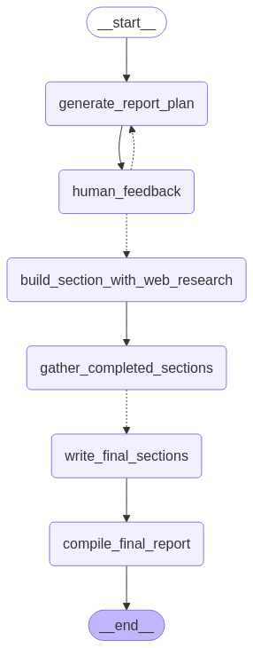
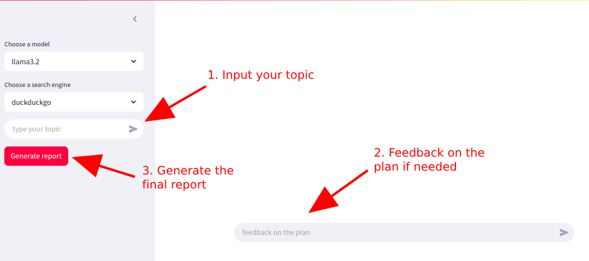

# easyResearch
A simple researchbot with the ability to research on the internet.

## Description

This project creates a researchbot program that runs locally on CPU using the LangGraph, Ollama, and Streamlit frameworks.

## How it works

Base on your topic, the researchbot will create a plan and it can be modified by your feedbacks. Finally, the report will be generated if you get satify.



## Getting Started

### Dependencies

* OS: Ubuntu (22.04, 24.04).
* Installed packages: [Ollama](https://ollama.com/download/linux), [Docker](https://docs.docker.com/engine/install/ubuntu/), [virtualenv](https://virtualenv.pypa.io/en/latest/installation.html).

### How to use

1. Open a terminal and clone this repository:

```
git clone https://github.com/tomsawyer0224/easyResearch.git
cd easyResearch
```
2. Run the following command to create a virtual environment and install all requirements.
```
source init.sh
```
3. Modify the 'config.yaml' file if needed. By default, the researchbot is powered by 'llama3.2' and 'llama3.2:1b' in the Ollama framework. When using it, you can choose either of them.

4. Build a Docker image by running the command (on a terminal inside the 'easyResearch' directory):
```
python build_docker.py
```
* To start the researchbot, run command:
```
docker run --name eResearcher --rm -p 8501:8501 researchbot
```
or in background mode:
```
docker run --name eResearcher --rm -d -p 8501:8501 researchbot
```
* Access the application at http://localhost:8501.
* To stop the researchbot, run command:
```
docker stop eResearcher
```
## Limitations
Perfomance of the researchbot is not so good because:

* The small ollama models is not enough powerful.
* The free search tools (duckduckgo, arxiv) may return unexpected results or sometime throw errors (e.g "Rate Limit" of DuckDuckGo).

This is CPU-based application, it takes very long time to finish, and we can't use large models to improve the quality of reports.

## License

This project is licensed under the MIT License - see the [LICENSE](./LICENSE) file for details.
## Acknowledgments
* [open-deep-research](https://github.com/langchain-ai/open_deep_research)
* [Streamlit](https://docs.streamlit.io/)
* [LangGraph](https://langchain-ai.github.io/langgraph/tutorials/introduction/)